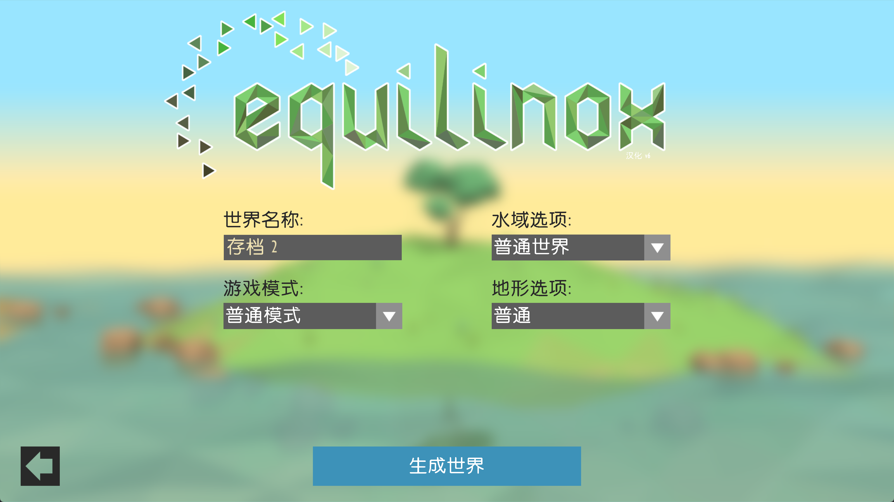
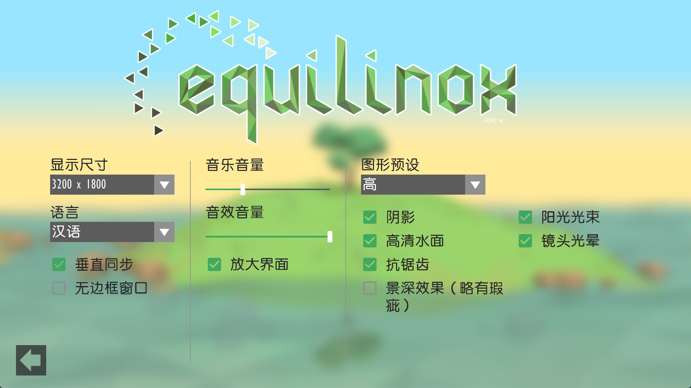
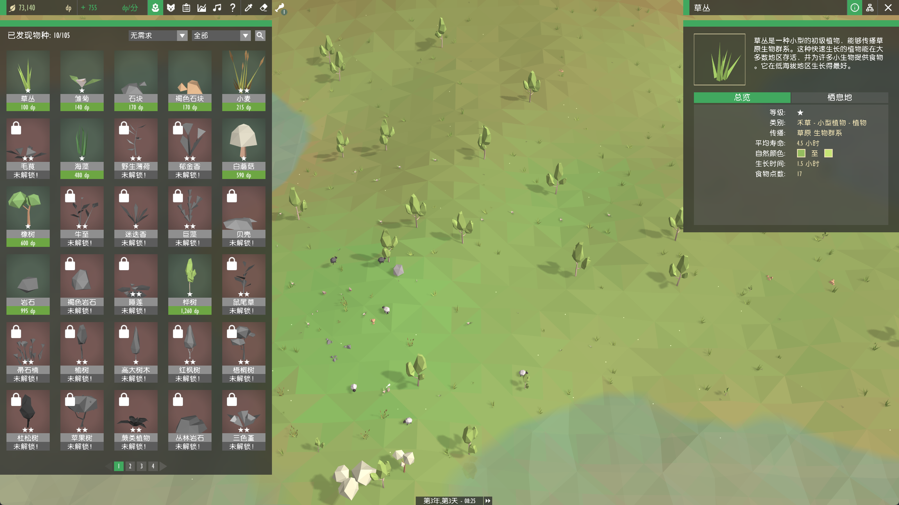
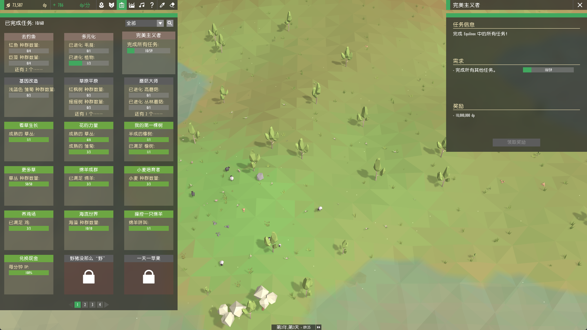
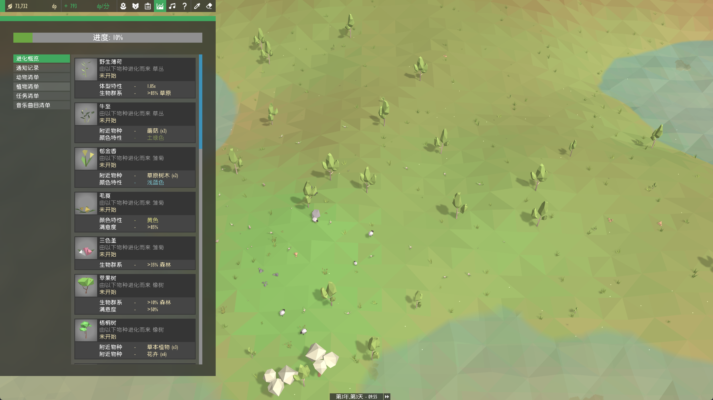
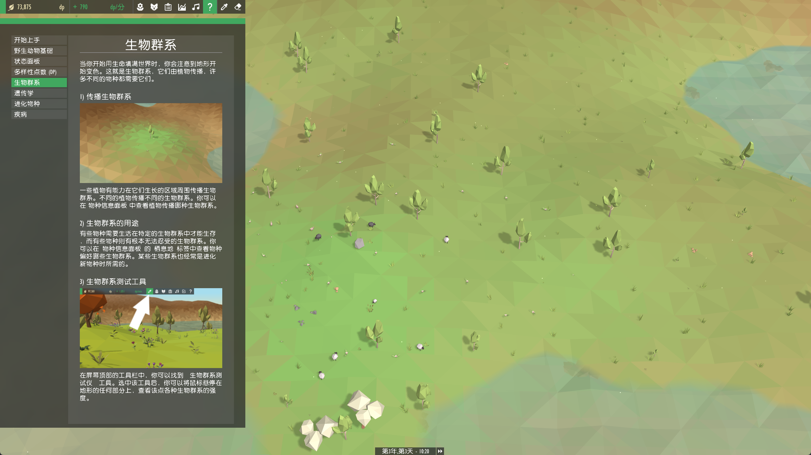

# Equilinox 简体中文汉化补丁

[Equilinox](https://store.steampowered.com/app/621880/Equilinox/) 是一款在 Steam 上广受好评的生态模拟游戏：在属于自己的小岛上培育生命、塑造自然、见证物种进化。这个项目为它带来完整的简体中文体验——从第一行界面到最后一页图鉴，全程中文。

## 项目特色

- **全文本汉化**：主菜单、选项、任务、帮助等全部 1174 条界面文本，包括所有物种名称与描述
- **细节全覆盖**：游戏内散布的界面文字（能力、攻击力、收获、状态、捕食等）也全部中文化
- **专属中文字体**：方正准圆字体重制的游戏内字体，与原版英文 Gill Sans 的圆润风格协调统一；中文显示清晰平滑、边缘干净
- **中文排版优化**：专为中文设计的逐字换行，任意长度的文本都能整齐显示
- **全环境兼容**：不受系统语言区域设置影响，任何电脑上都能正常显示中文
- **本地化细节**：语言选项显示"汉语"、存档名汉化（"存档 1"）、底部时间显示"第1年,第1天 - 09:45"等

## 游戏截图

| | |
|:---:|:---:|
|  |  |
|  |  |
|  |  |
|  |  |

## 安装使用

1. 从 [Releases](https://github.com/Landslide3154/equilinox-cn-patch/releases) 页面下载 `equilinox-cn-patch-v6.zip`（精简版补丁，约 4MB）
2. 解压后**关闭游戏**，双击 `安装汉化.bat`——脚本会自动查找 Steam 游戏目录，找不到时也可以手动输入
3. 启动游戏，享受中文世界

想恢复英文原版？双击 `恢复原版.bat` 即可。

## 注意事项

- 适用于 Steam 版 Equilinox 1.7.2，请购买正版游戏后使用
- 安装脚本会自动备份原版文件（`EquilinoxWindows.jar.orig.bak`），随时可恢复
- 如果 Steam 执行了"验证文件完整性"，游戏会被还原为英文，重新运行一次安装脚本即可
- 本补丁仅修改本地游戏文件，不包含游戏本体

遇到问题或建议？欢迎在 [Issues](https://github.com/Landslide3154/equilinox-cn-patch/issues) 提出。

## 许可证

翻译文本与构建脚本采用 [MIT](LICENSE) 许可；项目内含的反编译源码版权归原作者 ThinMatrix 所有，仅供学习参考。
